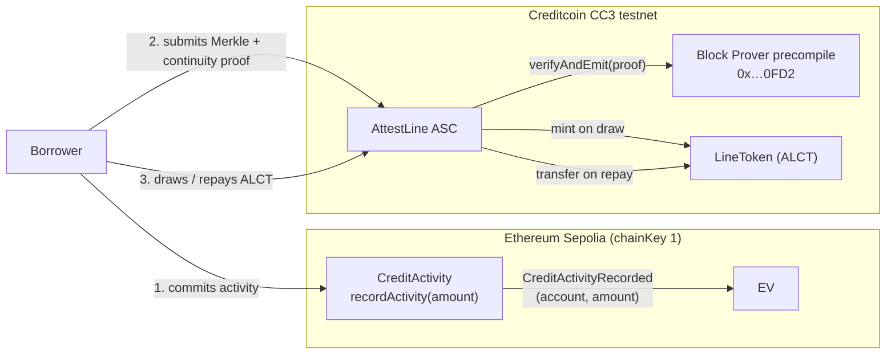

# AttestLine

**Cross-chain credit lines on Creditcoin, underwritten by attested on-chain activity.**

AttestLine is a DeFi protocol on [Creditcoin](https://creditcoin.org) that grants on-chain credit
lines to borrowers based on **attested cross-chain on-chain activity**. It is an *Attestcoin Smart
Contract* (ASC): underwriting is driven by inclusion proofs of transactions that happened on a
source chain (Ethereum Sepolia), verified natively on Creditcoin through the Attestcoin Protocol's
Block Prover precompile — **no centralized oracle operators**.



## How it works

1. **Record activity.** Alice calls `recordActivity(amount)` on the source-chain `CreditActivity`
   contract (Sepolia). The contract emits a single, unambiguous
   `CreditActivityRecorded(address indexed account, uint256 amount)` event — the only event the
   protocol accepts.
2. **Prove it.** Alice submits a proof of inclusion (Merkle proof + continuity chain) for that
   transaction to `AttestLine.requestCreditLine(...)`. The ASC calls the Block Prover precompile's
   `verifyAndEmit` — the proof is verified natively on Creditcoin against the attested header
   chain. No oracle, no trust in a third party.
3. **Underwrite.** AttestLine decodes the attested transaction with `EvmV1Decoder`, checks that the
   receipt status is `1` (the precompile only proves *inclusion*, not *success*), that the event was
   emitted by the registered source contract, and that the attested account is the caller. A pure
   `CreditScore` library maps the attested amount to a credit score (300–850), a credit limit
   (0.5×–1.5× of the attested amount) and an APR tier (18%–8%).
4. **Borrow and repay.** Alice draws up to her limit in `LineToken` (ALCT), and repays with
   interest. Interest is simple, linear, per-block, at `rateBps` per year. Lines are
   reputation-collateralized: past the deadline with outstanding principal, anyone can mark a line
   defaulted (freezing draws; repayment remains allowed) — a permanent on-chain reputation record.

## Repository layout

```
contracts/          Solidity: AttestLine ASC, CreditScore, LineToken, CreditActivity,
                    INativeQueryVerifier (vendored), test mocks (MockVerifier, TestHarness)
src/                TypeScript SDK layer: config, types, AttestLineClient (wraps @gluwa/usc-sdk)
scripts/            deploy.ts (network-aware), demo.ts (live E2E, gated), worker.ts (gated)
test/               Deterministic tests: CreditScore, AttestLine (hardhat + MockVerifier at
                    the precompile address), client unit tests (mocha + sinon, no network)
docs/               attestcoin-integration.md, testnet-deployment.md
```

## Quickstart

```bash
npm ci
npx hardhat compile      # compiles contracts + generates TypeChain types
npm test                 # runs everything (contracts + SDK units) — deterministic, no RPC
npm run build            # typechecks and emits the CommonJS SDK build (dist/)
```

### Local contract tests (no RPC, no secrets)

`npm test` runs:

- **CreditScore.test.ts** — exact score/limit/APR values for a table of amounts, monotonicity,
  zero/edge inputs, cap at 850.
- **AttestLine.test.ts** — deploys a `MockVerifier` at the Block Prover precompile address
  (`0x…0FD2`) via `hardhat_setCode`, so the *real* code path (calling the precompile address
  through `NativeQueryVerifierLib.getVerifier()`) is exercised deterministically. Covers the happy
  path (grant → draw → repay → settle), replay protection, wrong chain/height/root, failed
  receipts, foreign-source events, account mismatches, limit overruns, interest math, defaults,
  and ownership.
- **client.test.ts** — unit tests for `AttestLineClient` with the proof builder and contracts
  stubbed (no network).

### Deploy & demo on the CC3 testnet

See [docs/testnet-deployment.md](docs/testnet-deployment.md) for a step-by-step guide
(faucet, env vars, deployment, demo, worker).

## The Attestcoin Protocol integration

AttestLine verifies cross-chain transactions through the **Block Prover precompile**
(`0x0000000000000000000000000000000000000FD2`) and reads chain metadata from the **ChainInfo
precompile** (`0x0000000000000000000000000000000000000FD3`), using the official `@gluwa/usc-sdk`
(proof builder + chain info providers) and `@gluwa/usc-contracts` (EvmV1Decoder) packages. See
[docs/attestcoin-integration.md](docs/attestcoin-integration.md) for the deep dive: proof flow,
replay protection, why `receiptStatus` must be checked, and the scoring model.

## Security notes

- **Inclusion ≠ success.** The precompile proves a transaction is *included* in a finalized,
  attested block; AttestLine always decodes the receipt and requires `receiptStatus == 1`.
- **Replay protection.** Every processed proof is keyed by
  `keccak256(chainKey, blockHeight, txIndex)` (txIndex from the Merkle sibling path) and can only
  be used once.
- **Source contract allowlist.** Only events emitted by the owner-registered source contract are
  accepted.
- **Reputation-collateralized.** There is no liquidation of collateral in v1; defaulting is a
  permanent on-chain credit event.
- The contracts are non-reentrant (OpenZeppelin `ReentrancyGuard`), use checks-effects-interactions,
  and revert with explicit error names. **This is reference software — audit before production use.**

## License

MIT — see [LICENSE](LICENSE).
